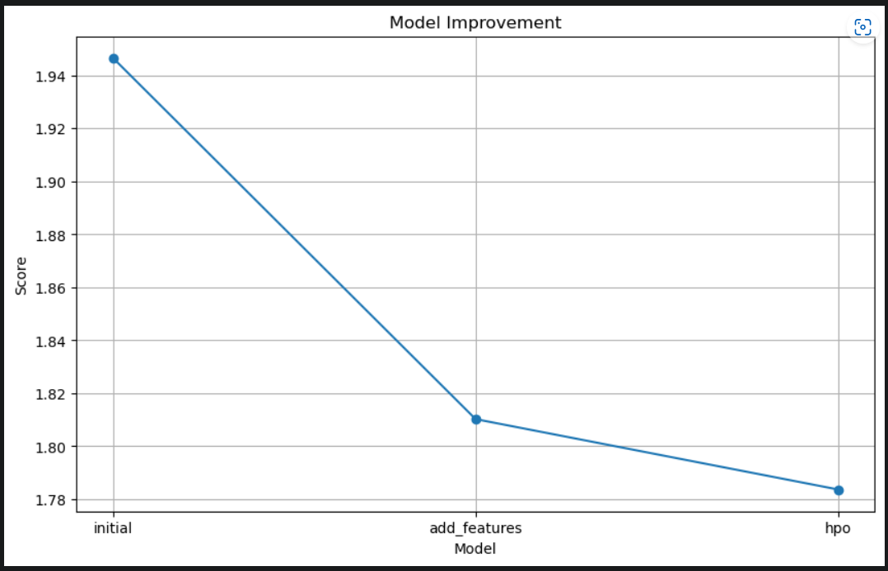
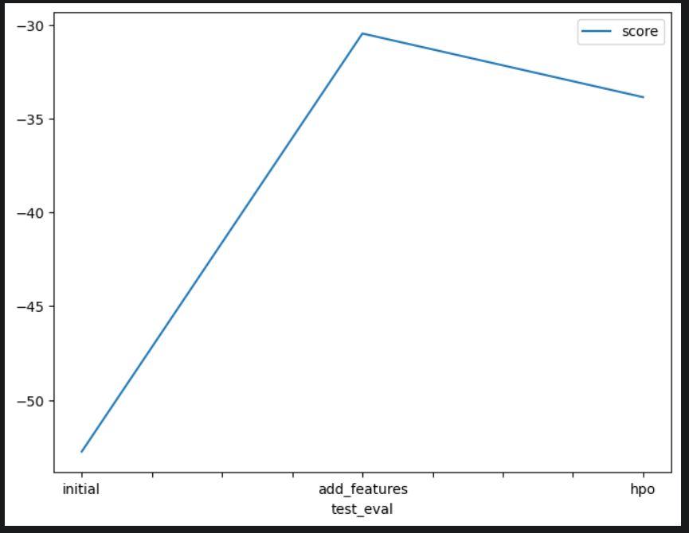

# Report: Predict Bike Sharing Demand with AutoGluon Solution
#### Owen Sanchez

## Initial Training
### What did you realize when you tried to submit your predictions? What changes were needed to the output of the predictor to submit your results?
TODO: Add your explanation
I just realize that the way I handling datatime was incorrect and deny my try.
I change the way the struture to fit to the bike sharing demand try.
### What was the top ranked model that performed?
TODO: Add your explanation
WeightedEnsemble_L3 without additional features
WeightedEnsemble_L3 Also with additional features
## Exploratory data analysis and feature creation
### What did the exploratory analysis find and how did you add additional features?
TODO: Add your explanation
That help me out to find out that the datatime and weather don't help at all and need to add those new features divid datatime by hour, dayofweek, is_weekend, holiday and workingday.
### How much better did your model preform after adding additional features and why do you think that is?
TODO: Add your explanation
A lot in prediction I can see a change from -52 to -30 / in score of bikeSharing 1.98 to 1.80
## Hyper parameter tuning
### How much better did your model preform after trying different hyper parameters?
TODO: Add your explanation
Better with a little improve of score with 1.72 but in prediction -33
### If you were given more time with this dataset, where do you think you would spend more time?
TODO: Add your explanation
More time fixing Hyper parameters.
### Create a table with the models you ran, the hyperparameters modified, and the kaggle score.
|model|hpo1|hpo2|hpo3|score|
|--|--|--|--|--|
|initial|None|None|None|1.94751|
|add_features|None|None|None|1.80639|
|hpo|num_boost_round|num_leaves|learning_rate|1.72237|

### Create a line plot showing the top model score for the three (or more) training runs during the project.

TODO: Replace the image below with your own.

### Create a line plot showing the top kaggle score for the three (or more) prediction submissions during the project.

TODO: Replace the image below with your own.

## Summary
TODO: Add your explanation
In this project I structure these parts of fundamentals of AI like transform data, data analysis, training the model and evaluate them, also fixing and improve by using hyper parameters. At the beggining was very confused for me because I had a lot of problems with this jupyter notebook, but facing these problems I complete succesfully this problem and now I feeling ready for new challenges.
